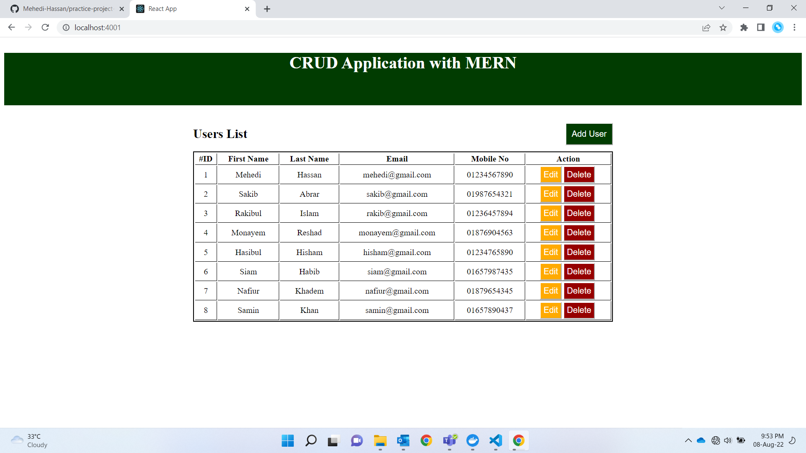
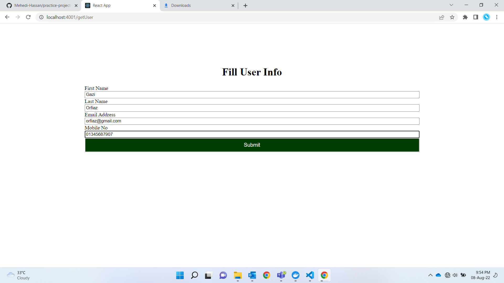
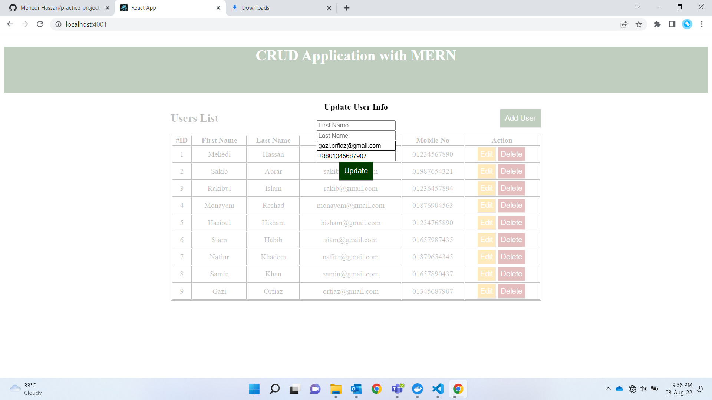
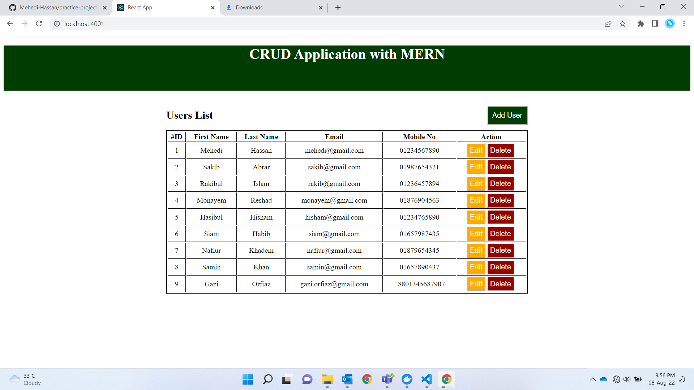
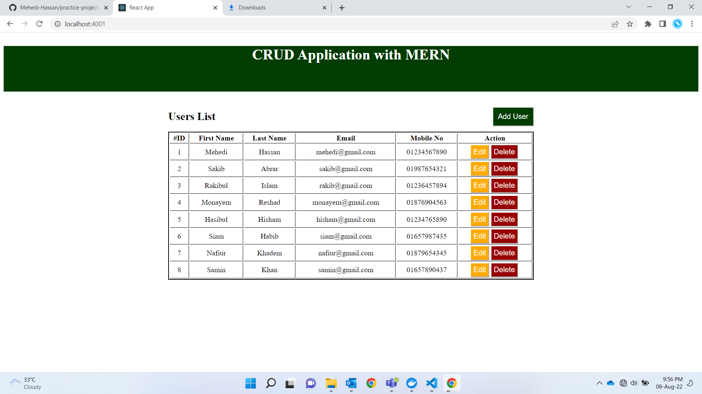

# practice-project-docker
A simple CRUD web application using MERN.

# Home Page:
Shows list of users from MongoDB database.

 
 

# Adding User:
New user can be added by clicking on "Add User".

User has been added (#ID 9).

 
 

# Updating User Info:
User can be updated by clicking on "Edit".

User info has been updated (#ID 9).

 
 

# Deleting User:
User can be deleted by clicking on "Delete".

Rest of users after deleting

